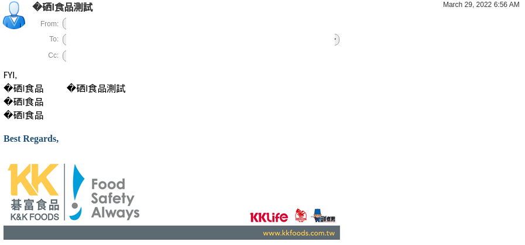
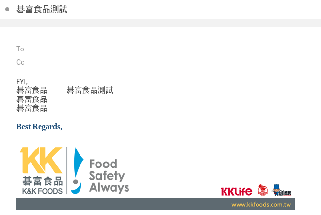
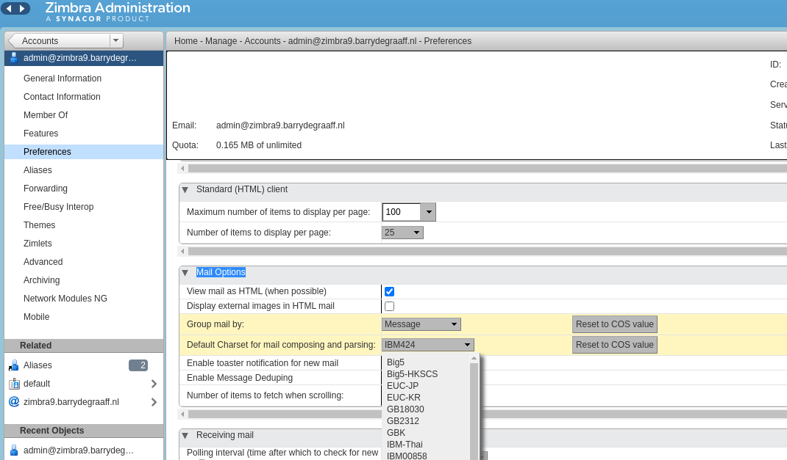

# Fix encoding issues for Chinese Characters

Some email clients such as Outlook on Windows may use the so called code page 950 or big5 character set when writing emails in Chinese. Since these charsets are not defined in a formal standard this can lead to some character be displayed as a question mark to indicate a character set problem when you receive emails.



Since Zimbra is using native Java libraries (java.nio.charset.Charset) to deal with character sets, both the Classic and Modern UI are equally affected by this issue.

You can verify that your email indeed used big5 encoding by viewing the message source (Show original menu) and check the Content-Type header:

````
Content-Type: text/plain; charset="big5"
````

To fix this issue you can set the Zimbra preference `zimbraPrefMailDefaultCharset` to `x-Big5-Solaris`. The `x-Big5-Solaris` encoding is the most complete implementation of big5 in Java java.nio.charset package. Please see the link under further reading for technical details.

`zimbraPrefMailDefaultCharset` can be set on an account or at Class of Service (CoS) level.

````
#To set on an account:
zmprov ma user@example.com zimbraPrefMailDefaultCharset "x-Big5-Solaris"
#To set on the default CoS:
zmprov mc default zimbraPrefMailDefaultCharset "x-Big5-Solaris"

#Flush all cache
zmprov fc all

````

When this setting is applied and the browser cache is emptied, the message is rendered correctly:



In a future patch the default character set setting can also be found in the Admin Console UI.



Further reading

- https://docs.oracle.com/javase/8/docs/technotes/guides/intl/encoding.doc.html
